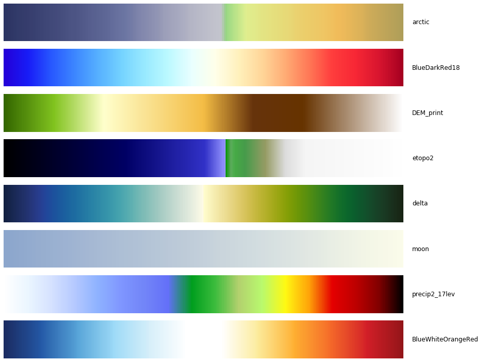

# `get_cpt`: a python utility to fetch `matplotlib` colormaps from `.cpt` files

**The goal:** To provide an easy, unified interface to load external and custom colormaps in `matplotlib`. The focus is on `.cpt` files, which are a common standard in external colormaps [[1]] and are frequently featured in colormap repos such as cpt-city [[2]].

**The background:** Multiple tools to load `.cpt` files already exist (e.g. see here: [[3]],[[4]]). The most encapsulated effort is `pycpt` [[5]], a well-written package that is able to load `.cpt` files from multiple sources. However, this package was originally made for python 2.x and has certain limitations and, sometimes, added complexity for many user groups. 

**The functionality:**
- To create a simple, flexible interface where `.cpt` files can be loaded, building from `pycpt`.
- To utilise the robust engine of `pycpt` for parsing `.cpt` files, after some tweaks and updates. 
- To allow multiple use cases of easy `.cpt` file loads from the user (from full paths, from a preset repo, from a url). 
- To control and simplify the complexity `matplotlib` introduces with its multiple classes of colormaps, but offer added functionality to the user as well, in case he/she wants hex color lists, fewer colors, `ListedColormap` objects instead of `LinearSegmented` ones etc.

**Requirements:**
- python `3.6` or newer
- numpy `1.14` or newer
- matplotlib `2.2.2` or newer

Tested in two environments: (py 3.7|np 1.18.1|mpl 3.1.3) and (py 3.6|np 1.14.2|mpl 2.2.2)
Also uses `urllib` for the url handles.

**Howto:**
Instructions are provided in the relevant Jupyter Notebook tutorial.

**Closing remarks:**
- Every modification or enhancement/redevelopment of the code is welcome.
- If you would like to use this module to your work, please refer to its Zenodo DOI (10.5281/zenodo.3703160)(https://zenodo.org/record/3703160#.XmfGXqhKiUk), as well as the original pycpt package (https://github.com/j08lue/pycpt). 

[1]: https://en.wikipedia.org/wiki/CPT_(file_format)
[2]: http://soliton.vm.bytemark.co.uk/pub/cpt-city/
[3]: https://stackoverflow.com/questions/48322741/is-there-a-way-to-save-a-custom-matplotlib-colorbar-to-use-elsewhere
[4]: https://scipy-cookbook.readthedocs.io/items/Matplotlib_Loading_a_colormap_dynamically.html
[5]: https://github.com/j08lue/pycpt/blob/master/pycpt/load.py
